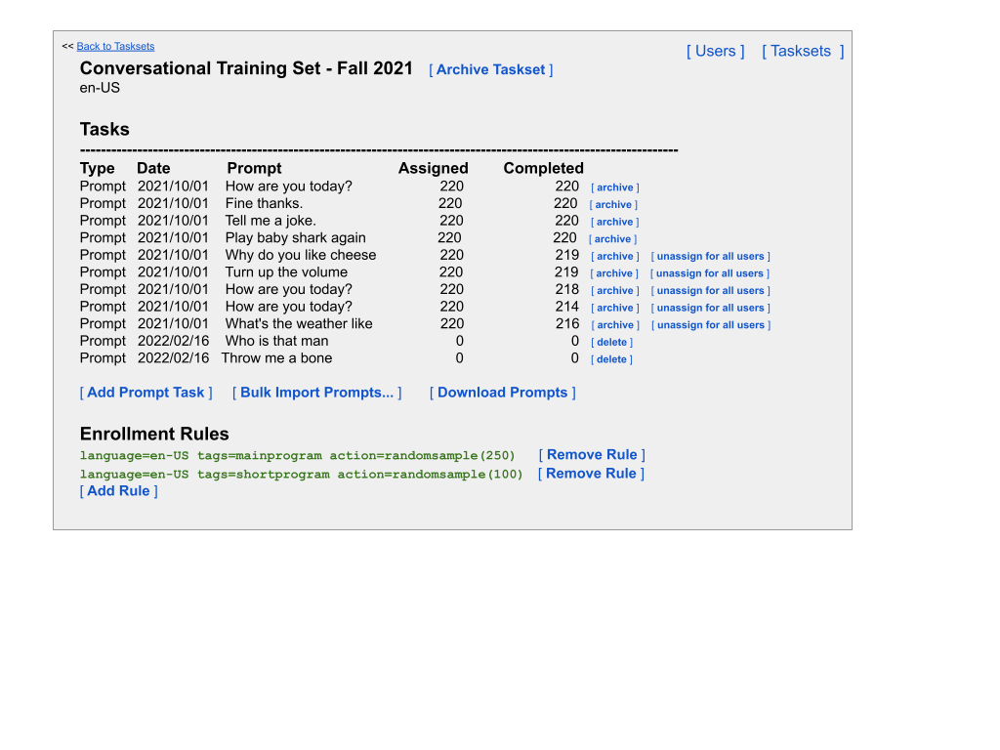

# **Design Overview**

### **Motivation and objective**

Project Euphonia has demonstrated that it's possible to collect a large, useful dataset of impaired speech samples from participants using consumer devices in at-home settings. There is now a strong and demonstrated need for other institutions, both corporate and academic, to develop and share a dataset like this. To support these needs, Euphonia has published this reference implementation which encapsulates some of our expertise and best practices.

### **Technology Choices**

A summary of key technology choices for various components of this system:

- **HTML5/CSS/JQuery**: A versatile and reliable UI platform. No higher level toolkit is used, to keep the app simple, portable, and clean of proprietary dependencies.
- **TypeScript**: A popular, professional grade, typesafe alternative to Javascript which catches common programming errors and is generally easier to read and maintain.
- **Google Cloud Platform project**: A GCP project is required to house computing and storage resources such as Firebase and GCS.
- **Firebase platform**: The web app can be deployed via Firebase, which is a simple yet reliable toolkit that interoperates well with Google Cloud APIs such as GCS and Firestore.
- **Firebase Hosting**: serves static content such as HTML/CSS/JS of the browser side of the app.
- **Firebase Functions**: used to implement a service API for the web UI, for basic functions such as registering for the program, serving phrase lists, and receiving recordings.
- **Node.js**: implements the server endpoints, following patterns recommended by Firebase. It is a reliable, industry standard toolkit and language.
- **Express.js**: implements a simple web server in node.js, with a few useful features like cross-endpoint authentication filtering.
- **chai/intern**: an open source Javascript-based unit testing framework for driving tests and writing assertions.
- **Firebase Authentication**: permits restriction to the Google Identity Provider, which allows each request to be rejected until the user is signed in. This further permits arbitrary authorization rules such as allowlisting, admin users, etc. A future implementor could activate other Federated identity provider integrations as well.
- **Firestore**: stores simple user metadata such as registration status and phrases completed, with reasonably performant queries.
- **GCS**: stores recorded audio, in a simple JSON format, which can be exported later for research.
- **GitHub**: Houses source code and implements version control. Repository will have ACLs for now, but will become open to others once we have an initial version drafted.

### **Proposed Architecture**

At a glance:

### **Key Functions**

Based on design inputs gathered from experts, the high level functions/UX in the system are roughly:

- **User registration**: collects interest form from anyone, collects consent, stores interest form responses, creates user record and assigns a non-identifying program ID such as a Euphonia EUID or a Relate hash.
- **Recording tasks**: Shows the user prompt/task cards for them to complete. Permits listening to current recordings, collects new recordings, shows count and status. Uploads audio to storage. We expect the GUI to be "just like Project Relate" recording cards. Some keyboard support and cross-platform browser testing will be needed.
- **User Profile**: A secondary view where users can review their general status in the project, including what they've completed so far.
- **Phrase/task administration**: Program administrators should be able to define and maintain sets of phrases, and (later) other kinds of recording tasks. These sets of tasks should be assignable to batches of users, with one assigned to new users automatically.
- **User administration**: Program administrators should be able to review the status and progress of an individual user, including the specific tasks they've completed, phrase sets assigned to them, and listen to the actual audio for quality purposes.
- **Batch task assignment**: Program administrators may need to make changes to many users at once, to implement policy changes. A bulk-edit GUI will support searching for subsets of users by various criteria, and applying subsets of tasks to them.
- **Authentication**: users must sign in with their Google Account before they can use the registration function or any other part of the system. Once they sign in, their past contributions are all tied to that login.

# **Functional Design**

## **Data Concepts**
The system manages participants and their recordings. Some more detail around the proposed data which is managed and stored:

### **Users**
The end-user participants who enroll in the program and perform recordings.
- Each user needs to be stored in Firestore, with some minimal metadata.
- User metadata includes:
    - the user's Google Login email address
    - the user's assigned EUID (a de-identified ID specific to Euphonia)
    - any system preferences
    - consent version / timestamp
    - suspension status
    - language(s) - determined by a web param on enrollment
    - tags - determined by a web param on enrollment

### **Administrators**
Google Account logins that are ACL'd to have administration, data review, and task assignment privileges within the system. Administrators can:
- add or suspend Users
- create and manage Tasksets
- assign Tasks and Tasksets
- set default tasksets for new Users to automatically receive on enrollment
- review completed user Tasks and their Recordings
- bulk actions
- completion statistics

### **Tags**
Although not separately stored, the system supports a concept of "tags" which are attached to users upon enrollment.
- A user's tags are used in a few places, like to match them to a particular consent or a particular set of tasks. See below.
- Tags are specified in an invitation URL as HTTP parameters; when a user is given a shortlink or invitation URL to sign up with the system for the first time, any tags found in the URL they used get associated with them.
- Tags on a user can also be attached/changed manually by an administrator.

### **Consents**
The system stores a list of all the consent text we ever show to users, along with a unique ID. Why:
- All data collected through the system must be covered by at least one consent from the participant providing it.
- Over time we make changes to the consent, and we also offer different consents for different languages and programs.
- We also sometimes display multiple consents, some of which are optional and the user can still participate even if they declined.
- Anticipating a regular pace of change to consents, and the need to manage multiple consents, we track consents by ID and timestamp.
- If multiple consent IDs match the user's language, and if the user has any tag which matches a consent, then the user will see the latest live version of each matching consent, in sequence. (Required consents first, then optional consents.)
- If there is no matching consent for a user that signs up with a particular language or tag, they cannot proceed.
- Each consent has:
    - A readable but unique ID that the administrator will choose, like "euphonia-2022-worldwide".
    - A unique "live" timestamp indicating when this version should be live. Each consent ID can have multiple versions, ordered by their timestamps. The version with the latest timestamp prior to the current time will be the one displayed; older versions will be stored but not displayed. Consent versions can be uploaded into the future, which will cause them to be dormant until the current time passes the post-dated consent.
    - The user-facing text as an uploadable HTML file
    - A one-line description
    - Language, which causes it to be shown to users who speak that language.
    - Tags, which cause it to be shown to users enrolling with a given tag.
    - Requiredness: if the consent should be optional / the user should be allowed to decline it. There will be special language like "Decline (you will still be able to participate)" or similar.
    - Allow-old: When set, a user who already agreed to a previous version of a consent will NOT be asked to re-consent to the current version. However, users who have never consented to any version of a particular consent ID will be shown the latest live version.
- Each recording is marked with the consents the user had agreed to at the time of their recording. If a user later unenrolls, or withdraws consent, the recordings already made will still carry that record.
- Each time a user visits the recording page, their consent records are checked. If they haven't answered any applicable consents, or if new consent versions are live and do not permit "old" versions, they will be shown the consent flow again.
- If a user declines an optional consent, they will never be shown that consent again regardless of version.

### **Tasks**
Whatever prompts or recording tasks the program would like a user to do, the system creates an ordered list of tasks within each user's account in Firestore.
- When the user logs in, they see their task list and can perform the assigned tasks.
- Users cannot create or delete tasks, but they can skip tasks.
- Administrators can manage individual tasks assigned to a user, or manage many tasks / many users' tasks in bulk.
- Each task has a small amount of metadata in Firestore, such as:
    - The type of the task (initially only one type is supported, "Prompt", but others can be added in the future)
    - A reference back to the Taskset that it was created from
    - The content of the task, which is specific to its type; e.g. the textual prompt
    - The language code for the task

### **Recordings**
When the user completes a task, the data collected in the process of the user's work (typically an audio recording) is saved as a Record associated with that user.
- Recordings have blob data stored separately in GCS, which will be the audio stored as .wav.
- Recording metadata (other than the audio) is stored in Firestore, and includes:
    - An indelible unique ID which incorporates the EUID and can be used as the uttid
    - A reference to (and copy of) the task the recording was created from
    - The EUID and timestamp
    - Any other task-specific input
    - Telemetry about the recording device and software, collected from the browser
    - The list of consent [ID,version] pairs that the user had agreed to at the time of recording.

### **Tasksets**
A collection of task templates from which a user's assigned tasks can be drawn.
- Administrators create a Taskset which contains zero or more Task templates.
- For Prompted Tasks, each template is simply a prompt phrase which, when assigned to a User, gives them the Task to record themselves reading the prompt.
- In the future, other task types may be defined, and these can be added to Tasksets as well.
- Each taskset will have a language field, so users from other languages will not be assigned tasks from it unless their language matches. Tasks within the Taskset will all be in that same language.

### **Enrollment Rules**
The system stores an ordered list of automatic task assignment actions which trigger whenever a new user enrolls for the first time.
- Each action has an associated set of conditions which, if met by an enrolling user, cause it to create Tasks for that new user automatically.
- Each rule pertains to one Taskset, and therefore one language. When a user with the same language enrolls, the rules for that language are run.
- All rules apply, in order, to each user. Multiple enrollment rules can be used to create a heterogeneous set of Tasks for them to do.
- Rules have a priority, which determines the order in which the rules apply.
- Examples of conditions and actions:
    - A tag condition prevents the rule from applying unless the users enrolled with a specific tag. (Users get tags via URL parameters, so that sub-programs can be administered via invitation URLs. See above.) If a rule has no tag, it always runs.
    - An assign action can assign all Tasks in a particular Taskset to an enrolled user. Or,
    - A subselect action can choose a given smaller number of Tasks from a particular large Taskset, randomly.

## **Wireframe participant UX**
Here are some strawperson mockups to motivate discussions about detailed implementation:

Some behavior details:
- The "sign in" page will look slightly different if they're already signed in. There will be an OAuth consent flow.
- If the user selects one of our excluded countries during signup, the tool will not let them go further.
- If the user is already signed in and signed up, visiting the tool will skip the first five "Signup" screens and they'll go straight to the tool.
- If the user has recorded at least one recording, the instructions will be skipped.
- The hamburger menu will have options to see the instructions again.
- TODO: Allow re-recording?

More detailed signup wireframes:

### **Consent flow**
Once the user confirms their eligibility and answers the demographic questions, they are presented with the applicable consent(s) for their language and program tags:

#### **Open questions:**
- Do we present a scrollthrough of the consent text? Or just a link to the text (opens in separate window) and the user simply checks an opt-in checkbox?
    - *Comment: I think anything that minimizes clicking out of the UI would be good. So I prefer scrollthrough.*
- If it's a separate clickable link, i can show multiple consents as simply more checkboxes.
- However if it's a scrollthrough, how would we present multiple scrollthroughs for multiple consents? Each one on a separate page, with "next" buttons? Concatenated together in one long piece of text? What if some are required and some are optional?
    - *Comment: Yes I was thinking “next”. How about: for mandatory consents, if they don’t check “I consent”, don’t allow them to click “next/submit”. For optional ones, allow they to click “next/submit” even if they don’t check “I consent (optional)”*

Scroll-through version:

## **Administrative tools**

### **User List Screen**
Administrators can see all the users in the system here. For now this will be just one list, searchable using the browser's search tools. But it can have query features in the future, or be incorporated with bulk edit, see below.

### **Add User Screen**
Administrators can enroll a user manually, without them signing up. The administrator provides the email address, EUID, language, and any tags desired for that user. When the user first signs in, they will be prompted for the appropriate consent. ✅

### **User Detail Screen**
Administrators sometimes need to edit a user in detail, change their tasks, or debug their account. Users can also be suspended, or marked as a duplicate. Duplicate users will have all their recordings moved over to a different EUID, and the selected EUID will be permanently retired. When a user authenticates with an email address tied to a duplicate, they will act as the new de-dupped EUID instead. This effectively allows for a single user to have multiple email addresses.

### **Assign Tasks Screen**
When the administrator wishes to add tasks to a user, or to many users at once, they must choose which tasks they want to assign. This will let them select all tasks, random tasks, or specific tasks. ✅

### **Edit Tags Screen**
The administrator can add or remove tags from either a single user or a group of selected users.

### **Taskset List Screen**
The administrator can create multiple tasksets, which can contribute to users' assignments on enrollment, or be drawn from manually.

### **Taskset Detail Screen**
Groups of tasks can be managed together, assigned to users, deprecated, edited, and turned on for auto-assignment on enroll. Prompts can be bulk uploaded from a text file, where each prompt is delimited by newlines.

### **Consent Manager Screen**
The system must support multiple consents in multiple languages, each having potentially multiple versions. These may optionally match users by program tags, and a given user can be asked to agree to multiple consents.

### **Add/edit consent screen**

### **Consent Detail Screen**
Each consent has a language and tags. These attributes determine which users are required to see the consent. A consent can have multiple versions, only one of which is live at a time. Draft consent versions can be uploaded and post-dated so that they're not live yet. Once a user has consented to a particular version, it cannot be removed.

### **Add consent version screen**

# **Technical Design Details**

## **Codebase structure**
The system generally has:
- `websrc/...`: a frontend implementation in TypeScript, HTML, and CSS intended to run in web browsers such as Chrome.
- `websrc/admin/...`: implements the administrative portion of the GUI. Although keeping the admin UI separate is not part of the security design, it is helpful to keep separate the distinct needs, functions, and look-and-feel of the user-facing vs. admin-facing UX.
- `functions/src/...`: a server side implementation in TypeScript intended to run on node.js within Cloud Functions.
- `commonsrc/...`: TypeScript code which is agnostic to the above two platforms and can run in either one. Used for utilities and schema definitions that should be consistent between browser and server.
- `functions/tests/...`: TypeScript code which tests the Cloud Functions implementation in a fake node.js environment.

## **Consent Assurance**
Whenever the user starts a recording session, and whenever it's been more than 8 hours since the last check, the user's applicable consents are checked to confirm that still match the latest consent configuration. If the user has never agreed to one of the consents, or if their agreement matches a version that's been superseded, then the GUI prompts the user to consent again before they continue recording.

## **Counters and stats**
Counting queries in Firestore aren't efficient, so displaying how many users have assigned or recorded tasks would amount to full-database-scans on every page view of the taskset screen. Maintaining counter objects can result in contention (limit 1 write per second), and bulk assignment can result in enlisting too many counter objects in a transaction (limit 500). To address these limits, some denormalization will be needed, but this introduces consistency risks. Here are the counters we support (or could support).

### **Count of recordings per user**
Users only affect their own recordings, and there are no planned batch add or remove features for recordings, either for users or admins. So keeping a count on the user object would only contend with administrators who might happen to write to that user, and the user themselves if they do something concurrent (not likely/planned). Therefore, a simple count field on the user should work.

### **Count of recordings per task in a taskset**
Each time a user records, the corresponding task's recording count should be incremented by 1. Similarly, recording deletions should decrement. If many users record the same task, then there will be contention on the Task object across all concurrent users as this counter needs to be updated. This might be fine, since the number of exactly concurrent recorders of a certain task would hopefully be small --- e.g. two users that happen to start on their tasks at the same moment in the same order. With random assignment this would be even more improbable.

### **Count of total assignments in a taskset**
Since assignments are only performed by admins and on new user creation, contention on this operation may be much lower than recordings. Therefore, a simple counter per taskset which is updated in each assignment transaction is probably reasonable.

### **Count of users assigned in a taskset**
Separately from how many tasks are assigned out, the admin might like to know how many users are involved.
- **Option A: stored user counter per taskset**. Such a counter would be incremented on any assignment which involves a new taskset for a particular user. And would be decremented when any assignment removes the last task in a taskset for a user. Unfortunately, these two events are not discernable without loading all tasks assigned to a user, to determine whether any are left in the taskset. Since there may be more than 500 of these, this is not feasible within a transaction.
- **Option B: counters per-user-per-taskset and per-taskset**. Each user object could carry a list of counters, one per taskset, of how many tasks in each taskset are assigned. During bulk assign/unassign operations, these counters could be updated accurately within a transaction. If one of these counters changes from zero, or to zero, then this would indicate that the per-taskset counter should also be incremented (or decremented) by one user.

### **Count of assignments per task in a taskset**
Unlike recordings, assignments happen in batches. Enrollment auto-assign will burst many tasks' assignment counts by 1. Admin bulk-assign can burst many tasks' assignment counts by N, because bulk-assign pertains to multiple users at a time. Both of these can involve more than 500 tasks, which would bust Firestore's transaction limit if we tried to do a consistent update.
- **Option A: stored counters per task**. I think this is infeasible since we may want more than 500 tasks.
- **Option B: counter batch objects**. Similar to the distributed counters idea, each taskset could have a fixed set of N TaskCounter documents, where N=20 or similar, to reduce contention and stay below the 1MB document size limit. When a task is created, it is hashed to one of the 20 TaskCounter batches. Whenever a batch operation touches some tasks, it updates their counters in N batches --- each TaskCounter carrying the counts of some of the tasks. On read, the involved taskcounter batches would have to be fetched to display the counts. Batch assignments would contend with count reads a lot, because both of them would have a tendency to hit all batch objects.
- **Option C: counter journal**. Whenever a bulk assign action occurs, a journal object is created which carries all the count changes caused by that bulk assign. In practice this is a per-user-per-taskset document, carrying all the affected task IDs. On counter read, all journal documents would have to be read to look for the desired taskID. To compact the journal, all involved task documents would be written, and then the journal objects deleted. Since there might be more than 500 involved tasks, this work would have to be done in batches of less than 500 tasks at a time. The journal objects might need to be modified instead of erased, until all their involved counts drop to zero. Task reads (like those happening during bulk assign) would contend with counter compaction, but would NOT contend with counter update.
- **Option D: counter journal with batches**. Whenever a bulk assign action occurs, a journal object is created which carries all the count changes caused by that bulk assign. In practice this is a per-user-per-taskset document, carrying all the affected task IDs. On counter read, all journal documents would have to be read to look for the desired taskID. CounterBatch objects like those mentioned above would be updated transactionally. Any other counter read would contend, but writes and assignments would not.

### **Count of total recordings in a taskset**
The write pattern for total recording counts is the same as for per-task recording counts --- each user recording or deleting something will make one change. However, there are very few tasksets vs tasks, so the write contention is much higher.
- **Option A: stored counter per taskset**. There may be only one or two active tasksets in the whole system, so a single counter would be likely to have contention on every record action across all users. I deem this a scale risk even with few (100s) of users.
- **Option B: distributed counters per taskset**. Same as above but use this distributed counters technique to alleviate contention by 10x or 50x or whatever. This shifts some of the write cost to read cost.
- **Option C: count on read**. The count can be reconstructed accurately from listing all taskset tasks, which currently happens on the taskset detail screen anyway. So it would be easy to compute this number in the browser. However, we eventually plan to have tens of thousands of tasks, so this query will become impractically heavy and will turn into a paginated display or a search feature.
- **Option D: count and cache**. We can let one admin's request prompt the system to compute the count, and then store the result someplace, like a cache or a Firestore object. The count would become stale whenever a user records, which would happen many times per day in a busy system. The cache may have little benefit except in low-use systems. We would need to show an inaccurate value with a time-based expiration, or we would need a place to write an invalidation bit.
- **Option E: distributed counter with cache**. Same as D but using distributed counters. Same problem of either having the display be stale, or needing invalidation.
- **Option F: manual count button**. Same as Option D, but lets the admin decide when to refresh the counters and store them. The admin will have to wait until the computation is done.
- **Option G: counter journal**. When a per-task counter is changed, it also writes a new document in a "counters" area for the taskset, carrying the task ID and count=1. On read, all of the "counters" objects are summed and stored back into one consolidated value, with a timestamp, and then the counter items are erased. If there are more than 500 counter objects in the journal, the reader could process only some of them, and then iterate. It should be safe to process them in multiple transactions because the counter is still accurate in aggregate. To reduce contention amongst admins, we could do this compaction only randomly or something? Maybe not an issue?

### **Count of users per consent**
This counter will be increased by signups, reconsents, and consent creations. It will be decreased by revocations and user deletions, which are expected to be rare. A 1qps limit should be easily managed for this application even with many thousands of users. Therefore it can be stored directly on the central consent object.

